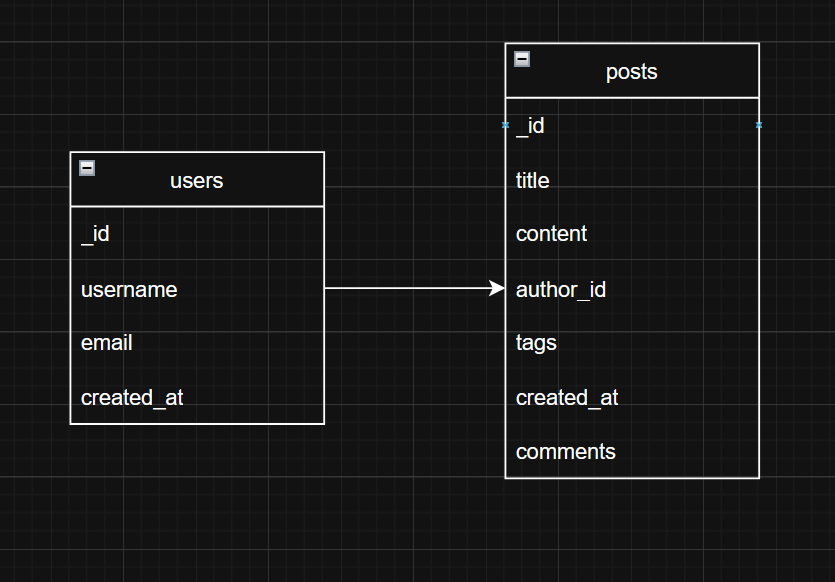
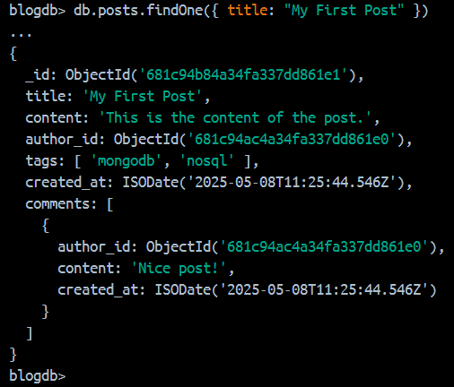
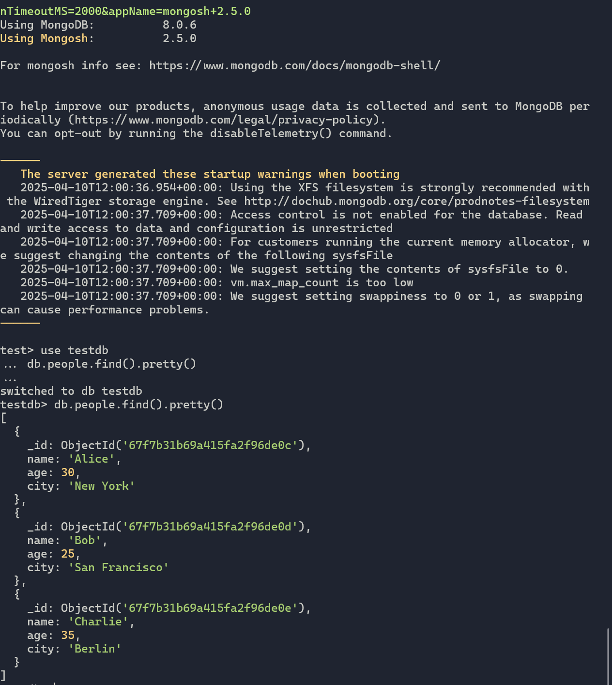
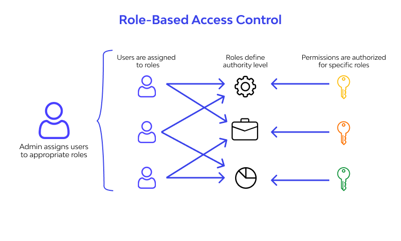
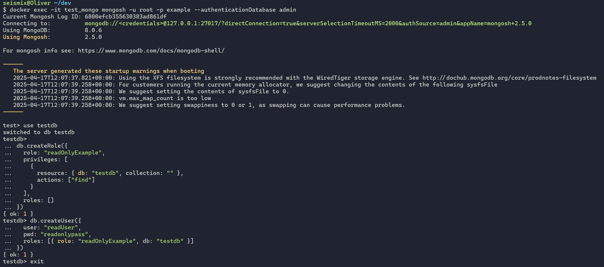
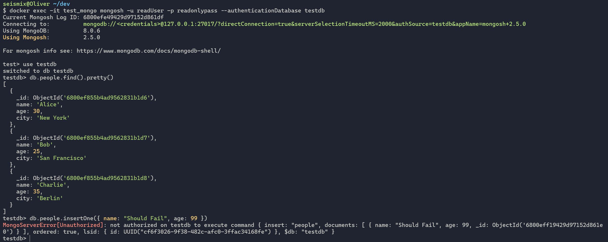
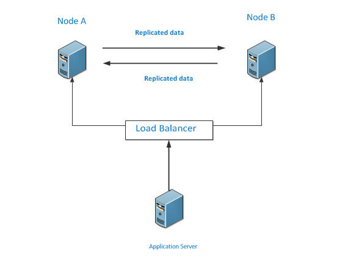
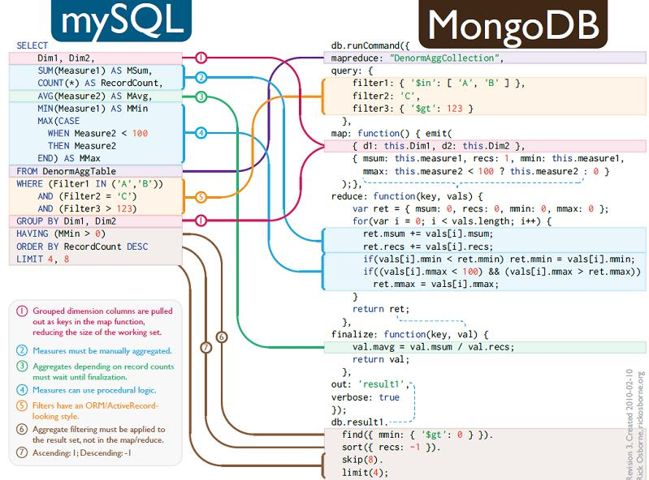
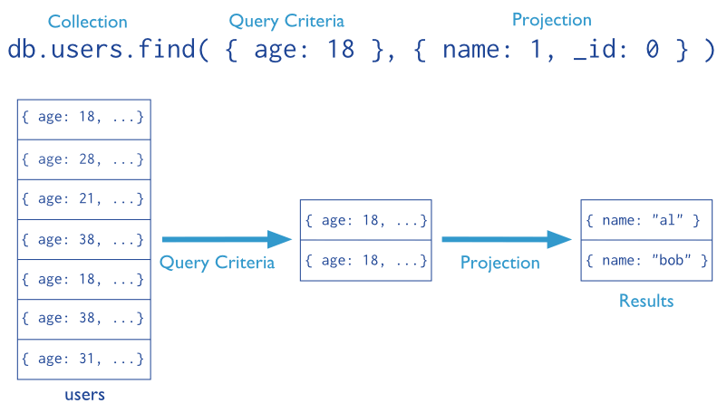

# Modul 165

KompetenzStufen
===============

Grundlagen | Stufe 1
-------------------

Diese Stufe ist als Einstieg ins Thema gedacht. Der Fokus liegt hier auf dem Verstehen von Begriffen und Zusammenhängen.

*Als Richtungshinweis: Wer alle Kompetenzen in dieser Stufe erfüllt, hat die Noten 3.0.*

Fortgeschritten | Stufe 2
------------------------

Diese Stufe definiert den Pflichtstoff, den alle Lernenden am Ende des Moduls möglichst beherrschen sollen.

*Als Richtungshinweis: Wer alle Kompetenzen in dieser Stufe erfüllt, hat die Noten 4.5*

Experte | Stufe 3

Diese Lerninhalte für Lernende gedacht, die schneller vorankommen und einen zusätzlichen Lernanreiz erhalten sollen.

*Als Richtungshinweis: Wer alle Kompetenzen in dieser Stufe erfüllt, hat die Noten 6*

Fragenkatolog
=============

Link zum [Fragenkatalog](url)

## NoSQL Grundlagen

[Wikipedia](https://de.wikipedia.org/wiki/NoSQL)

NoSQL (englisch für Not only SQL deutsch: „Nicht nur SQL“) bezeichnet Datenbanken, die einen nicht-relationalen Ansatz verfolgen und damit mit der langen Geschichte relationaler Datenbanken brechen. Diese Datenspeicher benötigen keine festgelegten Tabellenschemata und versuchen Joins zu vermeiden. Sie skalieren dabei horizontal. Im akademischen Umfeld werden sie häufig als „strukturierte Datenspeicher“ (engl. structured storage) bezeichnet.

Bekannte Implementierungen sind Riak, Apache Cassandra, CouchDB, MongoDB und Redis.

### A1G

>Ich kann Begriffe und Konzepte der NoSQL Datenbanken erläutern. (z. B. CAP-Theorem, BASE, ACID, Indexing Strukturen, Caching, Datenanalyse, Datawarehouse, FullText Search, Netzwerke, Testing).

Fragenstellung und Lernziele
==============

- Was sind die Grundbegriffe von NoSQL Datenbanken?

- Ich kann die Grundbegriffe und Konzepte von NoSQL Datenbanken erläutern.
- Ich erstelle eine Liste von Begriffen und Konzepten von NoSQL Datenbanken.

Umsetzung
=========

Grundbegriffe
-------------------

**BASE**

BASE beschreibt die Eigenschaften von NoSQL Datenbanken. Das Akronym steht für:

- Basically Available: Die Datenbank ist immer verfügbar, auch wenn sie nicht konsistent ist.
- Soft State: Der Zustand der Datenbank kann sich im Laufe der Zeit ändern.
- Eventually Consistent: Die Datenbank wird schliesslich konsistent, auch wenn sie es nicht sofort ist.

**ACID**

ACID beschreibt die Eigenschaften von Transaktionen in relationalen Datenbanken. Das Akronym steht für:

- Atomicity: Alle Operationen einer Transaktion werden entweder vollständig ausgeführt oder gar nicht.
- Consistency: Die Datenbank befind
- Isolation: Transaktionen werden unabhängig voneinander ausgeführt.
- Durability: Änderungen an der Datenbank werden dauerhaft gespeichert.

**CAP-Theorem**


Das CAP-Theorem besagt, dass eine verteilte Datenbank nicht gleichzeitig Konsistenz, Verfügbarkeit und Partitionstoleranz gewährleisten kann. Es besagt, dass in einem verteilten System nur zwei der drei Eigenschaften gleichzeitig garantiert werden können.

Weitere Begriffe
====================

| Begriff       | Beschreibung                                                                 | Beispiele       |
| :------------ | :--------------------------------------------------------------------------- | :-------------- |
| Indexing Strukturen | Indexe sind Datenstrukturen, die den Zugriff auf Daten beschleunigen. | B-Bäume, Hash-Indexe |
| Caching       | Caching ist eine Technik, bei der häufig benötigte Daten zwischen gespeichert werden, um den Zugriff zu beschleunigen. | Redis, Memcached |
| Datenanalyse  | Datenanalyse ist die Untersuchung von Daten, um Muster, Trends und Informationen zu erkennen. | Hadoop, Spark |
| Datawarehouse | Ein Datawarehouse ist eine zentrale Datenbank, in der Daten aus verschiedenen Quellen zusammengeführt und analysiert werden. | Amazon Redshift, Google BigQuery |
| FullText Search | Eine Volltextsuche ist eine Suchfunktion, die es ermöglicht, in Texten nach Wörtern oder Wortteilen zu suchen. | Elasticsearch, Solr |
| Netzwerke     | Ein Netzwerk ist eine Verbindung von mehreren Rechnern, die miteinander kommunizieren können. | TCP/IP, HTTP |
| Testing       | Testing ist der Prozess, bei dem Software auf Fehler und Probleme überprüft wird. | Unit-Tests, Integrationstests |

Vertiefte Begriffe
====================

| Begriff       | Beschreibung                                                                 | Beispiele       |
| :------------ | :--------------------------------------------------------------------------- | :-------------- |
| Sharding     | Eine Methode zur horizontalen Partitionierung von Datenbanken, bei der Daten auf mehrere Server verteilt werden, um die Last zu verteilen und die Leistung zu verbessern. | MongoDB, Cassandra |
| Replikation  | Die Erstellung und Aufrechterhaltung von Kopien von Daten, um die Verfügbarkeit und Zuverlässigkeit zu verbessern. | MySQL, PostgreSQL |
| Document Store | Eine NoSQL-Datenbank, die Dokumente als Datenspeicher verwendet. | MongoDB, CouchDB |
| Key-Value Store | Eine NoSQL-Datenbank, die Daten in Form von Schlüssel-Wert-Paaren speichert. | Redis, Memcached |
| Column-Family Store | Eine NoSQL-Datenbank, die Daten in Form von Spaltenfamilien speichert. | Cassandra, HBase |
| Graph-Datenbank | Eine NoSQL-Datenbank, die Daten in Form von Graphen speichert. | Neo4j, ArangoDB |
| Schema-less | Eine Eigenschaft von NoSQL-Datenbanken, bei der es keine festen Tabellenschemata gibt. | MongoDB, CouchDB |
| Polyglot Persistence | Die Verwendung mehrerer Datenbanken für unterschiedliche Anwendungsfälle. | MongoDB, Cassandra |
| Consistency Models | Modelle, die beschreiben, wie konsistent Daten in einem verteilten System sein können. | Eventual Consistency, Strong Consistency |

Nachweis
========

> [Quizlet](https://quizlet.com/ch/999306801/nosql-grundlagen-begriff-flash-cards/?funnelUUID=d8ff1b91-b5a4-4c9e-aee5-a8512ebab0d0)

### A1F

> Ich kann eine NoSQL Datenbank gezielt für eine spezifische Anwendung auswählen. (z. B. Document Store für Videos)

Fragenstellung und Lernziele
==============

- **Was sind die Anwendungsfälle für NoSQL Datenbanken?** Ich kann Anwendungsfälle für NoSQL Datenbanken nennen.
- **Wann brauche ich eine NoSQL Datenbank?** Ich kann die Anwendungsfälle für NoSQL Datenbanken erläutern.
- **Welche NoSQL Datenbanken eignen sich für welche Anwendungsfälle?** Ich kann 3 NoSQL Datenbanken nennen und ihre Anwendungsfälle erläutern.

Umsetzung
=========

Was sind die Anwendungsfälle für NoSQL Datenbanken?
---------------------------------------------------

- Big Data
- Echtzeit-Analyse
- Hochverfügbarkeit
- Skalierbarkeit
- Unstrukturierte Daten

Wann brauche ich eine NoSQL Datenbank?
--------------------------------------

Wenn...

- ...die Datenmenge zu gross für eine relationale Datenbank ist
- ...die Datenstruktur nicht festgelegt ist
- ...die Daten schnell verarbeitet werden müssen
- ...die Daten über mehrere Server verteilt werden müssen

Welche NoSQL Datenbanken eignen sich für welche Anwendungsfälle?
---------------------------------------------------------------

**Document Store**

 Eignet sich für Anwendungen, bei denen die Daten in Form von Dokumenten gespeichert werden sollen.

**Key-Value Store**

Beispielsweise bei Caching-Anwendungen, bei denen die Daten in Form von Schlüssel-Wert-Paaren gespeichert werden sollen.

**Column-Family Store**

Eignet sich für Anwendungen, bei denen die Daten in Form von Spaltenfamilien gespeichert werden sollen.

**Graph-Datenbank**

Datenbanke mit Graphen können verwendet werden, um Beziehungen zwischen Daten zu speichern.

Welche NoSQL Datenbanken gibt es?
---------------------------------

| Datenbank   | Anwendungsfall   | Databasetype |
| :--------- | :--------- | :--------- |
| MongoDB   | Dokumente speichern     | Document Store |
| CouchDB   | Offline bearbeiten und später synchronisieren   | Document Store |
| Redis   | Cache für schnellen Zugriff auf Daten   | Key-Value Store |
| Memcached   | Speichern von Schlüssel-Wert-Paaren   | Key-Value Store |
| Cassandra   | Speichern von Spaltenfamilien   | Column-Family Store |
| Neo4j   | Speichern von Graphen   | Graph-Datenbank |

Welche Vor- und Nachteile haben NoSQL Datenbanken?
-------------------------------------------------

| Vorteil   | Beschreibung   |
| :--------- | :--------- |
| Skalierbarkeit     | NoSQL-Datenbanken können horizontal skalieren, d. h. sie können auf mehrere Server verteilt werden, um die Last zu verteilen und die Leistung zu verbessern.     |
| Flexibilität     | NoSQL-Datenbanken haben kein festes Tabellenschema, was es ermöglicht, die Datenstruktur flexibel anzupassen.     |
| Hochverfügbarkeit     | NoSQL-Datenbanken können Replikation und Sharding verwenden, um die Verfügbarkeit der Daten zu verbessern.     |

| Nachteil   | Beschreibung  |
| :--------- | :--------- |
| Konsistenz     | NoSQL-Datenbanken können Eventual Consistency verwenden, was bedeutet, dass es keine Garantie gibt, dass alle Kopien von Daten in einem verteilten System sofort konsistent sind.No     |
| Komplexität     | NoSQL-Datenbanken können komplexer zu konfigurieren und zu verwalten sein als relationale Datenbanken.     |
| Mangelnde Unterstützung     | NoSQL-Datenbanken haben möglicherweise nicht die gleiche Unterstützung und Tools wie relationale Datenbanken.     |


Quellen
-------

> - [MongoDB](https://www.mongodb.com/nosql-explained)
> - [CouchDB](https://couchdb.apache.org/)
> - [Redis](https://redis.io/)
> - [Memcached](https://memcached.org/)
> - [FireShip Video](https://www.youtube.com/watch?v=W2Z7fbCLSTw)

### A1E

> Ich kann den Einsatz einer NoSQL Datenbank kritisch hinterfragen und Verbesserungen vorschlagen.

Fragenstellung und Lernziele
==============

- Wie kann ich den Einsatz einer NoSQL Datenbank kritisch hinterfragen? 

   - **Ich kann den Einsatz einer NoSQL Datenbank kritisch hinterfragen.**

- Welche Verbesserungen kann ich vorschlagen? 

    - **Ich kann Verbesserungen vorschlagen.**

Umsetzung
=========

Voraussetzung
-----

Die Voraussetzung für die kritische Hinterfragung des Einsatzes einer NoSQL-Datenbank ist ein **gutes Verständnis** der **Anforderungen** und **Einschränkungen** des Projekts.

Ich muss verstehen, welche **Daten** gespeichert werden und wie sie **verarbeitet** und **abgerufen** werden sollen. Ausserdem muss ich die **Skalierbarkeitsanforderungen** und die **Verfügbarkeit** der Datenbank berücksichtigen.

Wann brauche ich eine NoSQL Datenbank?
--------------------------------------

Wenn...

- ...die Datenmenge zu gross für eine relationale Datenbank ist
- ...die Datenstruktur nicht festgelegt ist
- ...die Daten schnell verarbeitet werden müssen
- ...die Daten über mehrere Server verteilt werden müssen

Wann brauche ich keine NoSQL Datenbank?
--------------------------------------

Wenn...

- ...die Datenstruktur festgelegt ist
- ...die Datenmenge klein ist
- ...die Datenbank nur auf einem Server betrieben wird
- ...die Datenbank nur für Transaktionen verwendet wird


Verbesserungen vorschlagen
--------------------------

| Verbesserung   | Beschreibung   |
| :--------- | :--------- |
| Optimierung der Datenstruktur     | Überprüfen, ob die Datenstruktur effizient ist und ob sie die Anforderungen des Projekts erfüllt     |
| Performance-Optimierung     | Überprüfen, ob die Datenbank die erforderliche Leistung erbringt und ob sie optimiert werden kann.     |
| Sicherheitsverbesserungen     | Überprüfen, ob die Datenbank ausreichend geschützt ist und ob zusätzliche Sicherheitsmassnahmen erforderlich sind.     |

## NoSQL Datenbanken implementieren

Im Kapitel NoSQL Datenbank implementieren wirst du schrittweise an die praktische Umsetzung von NoSQL-Datenbanken herangeführt.

- Zunächst lernst du, wie du ein bestehendes Datenmodell interpretierst und seine Struktur sowie Funktionsweise in einer NoSQL-Datenbank erläuterst.

- Anschliessend setzt du ein vorgegebenes Datenmodell in einer NoSQL-Datenbank um. Du erfährst, wie du Daten speicherst, abrufst und organisierst, um die Effizienz der Datenverwaltung sicherzustellen.
- Abschliessend entwickelst du eigene Datenmodelle für spezifische Anwendungsfälle. Hierbei lernst du, wie du Daten optimal strukturierst, um Skalierbarkeit, Performance und Anwendungsanforderungen bestmöglich zu unterstützen.

Dieses Kapitel gibt dir das Wissen und die praktischen Fähigkeiten, um NoSQL-Datenbanken effizient in Projekten zu implementieren und anzupassen.

### B1G

> Ich kann ein Datenmodell für eine NoSQL Datenbank interpretieren und erläutern.

Fragenstellung und Lernziele
==============

- Die Struktur eines Dokuments in einer dokumentenorientierten NoSQL-Datenbank verstehen.
- Eingebettete Dokumente und Arrays innerhalb eines Dokuments identifizieren und deren Zweck erläutern.
- Die Unterschiede zwischen dokumentenorientierten NoSQL-Datenbanken und relationalen Datenbanken hinsichtlich der Datenmodellierung beschreiben.
- Die Vorteile der flexiblen Schema-Struktur von NoSQL-Datenbanken für verschiedene Anwendungsfälle bewerten.

Umsetzung
=========

Dokumentenorientierte NoSQL-Datenbanken speichern Daten in einer flexiblen, hierarchischen Struktur. Anstelle von Tabellen mit festen Spalten und Zeilen verwenden sie **Dokumente**, die meist im **JSON-Format** gespeichert werden. Diese Dokumente enthalten verschiedene **Schlüssel-Wert-Paare** und können geschachtelte Strukturen wie **eingebettete Dokumente** und **Arrays** enthalten.

Wichtige Begriffe und Strukturen
---------------------------------------

Um die Struktur einer dokumentenorientierten NoSQL-Datenbank zu verstehen, müssen einige zentrale Konzepte betrachtet werden:

- **📜 Dokument** → Ein einzelner Datensatz, gespeichert als JSON-Objekt mit verschiedenen Attributen.  
- **📂 Collection** → Eine Sammlung von Dokumenten ähnlicher Art, vergleichbar mit einer Tabelle in relationalen Datenbanken.  
- **📎 Eingebettetes Dokument** → Ein Dokument, das innerhalb eines anderen Dokuments gespeichert ist. Dadurch können zusammengehörige Daten direkt in einem Eintrag gespeichert werden.  
- **📑 Array** → Eine Liste von Werten oder Dokumenten innerhalb eines Dokuments. Dies ermöglicht die Speicherung von mehreren Objekten innerhalb eines Feldes.  
- **🔑 Schlüssel-Wert-Paar** → Grundlegendes Element eines Dokuments, bestehend aus einem „Schlüssel“ und einem entsprechenden „Wert“.  

Beispiel eines Dokuments in einer „Benutzer“-Collection
-------------------------------------------------------

Ein praktisches Beispiel zeigt die Struktur eines Dokuments in einer NoSQL-Datenbank:

```json
// Collection: Benutzer
{                                             // Dokument für "Max Mustermann"
  "benutzer_id": "12345",                     // Schlüssel-Wert-Paar "benutzer_id" mit Wert "12345"
  "name": "Max Mustermann",
  "email": "<max.mustermann@example.com>",
  "adresse": {                                // Eingebettetes Dokument "adresse"
    "strasse": "Musterstrasse 1",
    "stadt": "Musterstadt",
    "plz": "12345"
  },
  "bestellungen": [                           // Array "bestellungen"
    {
      "bestell_id": "98765",                   
      "datum": "2025-03-01",
      "betrag": 99.99,
      "artikel": ["Buch", "Stift"]          // Array von Werten
    },
    {
      "bestell_id": "98766",
      "datum": "2025-03-15",
      "betrag": 49.99,
      "artikel": ["Notizbuch"]
    }
  ]
}
```

Hierbei sind mehrere NoSQL-spezifische Strukturen erkennbar:

- **Eingebettetes Dokument**: Die Adresse des Benutzers ist als Unterobjekt innerhalb des Hauptdokuments gespeichert.  
- **Array**: Das Feld `bestellungen` enthält eine Liste von Bestellobjekten, was eine 1:n-Beziehung direkt im Dokument abbildet.  

Diese Struktur ermöglicht eine **schnelle und effiziente Abfrage**, da alle relevanten Informationen direkt in einem Dokument gespeichert sind.

Unterschiede zwischen dokumentenorientierten NoSQL- und relationalen Datenbanken
-------------------------------------------------------------------------------

Die wesentlichen Unterschiede zwischen NoSQL- und relationalen Datenbanken lassen sich anhand verschiedener Aspekte aufzeigen:

| Merkmal                     | Dokumentenorientierte NoSQL-DB   | Relationale DB |
|-----------------------------|-----------------------------------|------------------|
| **Datenstruktur**           | JSON-Dokumente, eingebettete Objekte, Arrays | Tabellen mit Zeilen und Spalten |
| **Schema**                  | Flexibel, keine feste Struktur     | Fest definiert (Spalten müssen vorab definiert sein) |
| **Beziehungen**             | Daten können eingebettet sein      | Normalisierte Tabellen mit Fremdschlüsseln |
| **Skalierung**              | Horizontal (mehrere Server)        | Meist vertikal (leistungsstärkere Hardware) |
| **Performance für Lesezugriffe** | Sehr effizient für komplexe Objekte | Häufig JOIN-Operationen notwendig |

Während relationale Datenbanken für **strukturierte Daten** mit klaren Beziehungen optimiert sind, bieten dokumentenorientierte NoSQL-Datenbanken mehr **Flexibilität** und **Skalierbarkeit**.

Vorteile
========

Flexibilität in der Datenmodellierung
---------------------------------------

NoSQL-Datenbanken benötigen kein **festes Schema**. Dadurch können neue Felder hinzugefügt oder bestehende geändert werden, ohne dass komplexe **Schema-Migrationen** erforderlich sind. Dies ist besonders nützlich in agilen Entwicklungsprozessen, in denen sich Anforderungen häufig ändern.

Schnellere Lesezugriffe durch optimierte Abfragen
---------------------------------------

Da alle relevanten Daten in einem Dokument gespeichert sind, können Abfragen **schneller** ausgeführt werden, da keine **JOIN-Operationen** erforderlich sind. Besonders bei Anwendungen mit **hohem Leseaufkommen** (z. B. Webanwendungen, Echtzeitanalysen) ist dies ein grosser Vorteil.

Skalierbarkeit für grosse Datenmengen
---------------------------------------

NoSQL-Datenbanken unterstützen **horizontale Skalierung**, d. h. sie können einfach auf mehrere Server verteilt werden. Dies ist essenziell für Anwendungen mit **grossen Datenmengen** und **hohem Benutzeraufkommen**, z. B.:

- **Social Media Plattformen** (dynamische User-Daten, Kommentare, Likes)  
- **E-Commerce Systeme** (Produktkataloge, Nutzerverhalten, Transaktionen)  
- **IoT-Anwendungen** (Sensor-Daten, Echtzeitverarbeitung)  

Flexibilität in der Speicherung von unstrukturierten und semi-strukturierten Daten
---------------------------------------

Im Gegensatz zu relationalen Datenbanken, die ein **striktes Schema** erfordern, können dokumentenorientierte NoSQL-Datenbanken **heterogene Daten** speichern. Dies ist ideal für:

- **Log-Daten** (verschiedene Formate, je nach Quelle)  
- **Benutzergenerierte Inhalte** (Kommentare, Bewertungen, Posts)  
- **Maschinengenerierte Daten** (IoT- und Sensordaten)  

Fazit
------

Dokumentenorientierte NoSQL-Datenbanken bieten eine **hohe Flexibilität**, **effiziente Abfragen** und **gute Skalierbarkeit**, insbesondere für Anwendungen mit **dynamischen Datenmodellen** oder **grossen Datenmengen**. Sie eignen sich besonders gut für **Webanwendungen, Big Data und Echtzeitanalysen**, während relationale Datenbanken weiterhin eine gute Wahl für **transaktionsbasierte Systeme** mit **komplexen Beziehungen** sind.

Nachweis
========

### B1F

> Ich kann ein vorgegebenes Datenmodell mit einer NoSQL Datenbank umsetzen.

Fragenstellung und Lernziele
==============

- Wie kann ich ein vorgegebenes Datenmodell in einer NoSQL-Datenbank umsetzen? **Ich kann ein vorgegebenes Datenmodell in einer NoSQL-Datenbank umsetzen.**

- Wie erstelle ich eine NoSQL-Datenbank? **Ich kann eine NoSQL-Datenbank erstellen.**

- Wie speichere ich Daten in einer NoSQL-Datenbank? **Ich kann Daten in einer NoSQL-Datenbank speichern.**

Umsetzung
=========

Um ein vorgegebenes Datenmodell in einer NoSQL-Datenbank umzusetzen, sind folgende Schritte erforderlich:

- Die Struktur des Datenmodells verstehen und analysieren.
- Die NoSQL-Datenbank auswählen, die am besten zu den Anforderungen des Projekts passt. (MongoDB)
- Eine NoSQL-Datenbank erstellen und konfigurieren.

Das Datenmodell sieht wie folgt aus:



```json users
{
  "_id": ObjectId,
  "username": "johndoe",
  "email": "john@example.com",
  "created_at": ISODate
}
```

```json posts
{
  "_id": ObjectId,
  "title": "My First Post",
  "content": "This is the content of the post.",
  "author_id": ObjectId,
  "tags": ["mongodb", "nosql"],
  "created_at": ISODate,
  "comments": [
    {
      "author_id": ObjectId,
      "content": "Nice post!",
      "created_at": ISODate
    },
    {
      "author_id": ObjectId,
      "content": "Thanks for sharing!",
      "created_at": ISODate
    }
  ]
}
```
Um dieses Datenmodell in einer NoSQL-Datenbank umzusetzen, muss eine Datenbank erstellt werden.

Um eine MongoDB-Datenbank zu erstellen kann ein Docker-Container verwendet werden:

```yml docker-compose.yml

services:
  mongo:
    image: mongo:7
    container_name: mongodb
    ports:
      - "27017:27017"
    volumes:
      - mongo-data:/data/db

volumes:
  mongo-data:
```
Docker Desktop erlaubt es, ein Terminial zu öffnen, um mit der MongoDB-Datenbank zu kommunizieren. Hier können die Daten in die Datenbank eingefügt werden.

```bash bash
# connect to the MongoDB container
mongosh

# switch to the database
use blogdb

# insert a user
const userId = ObjectId();
db.users.insertOne({
  _id: userId,
  username: "johndoe",
  email: "john@example.com",
  created_at: new Date()
});

# insert a post
db.posts.insertOne({
  title: "My First Post",
  content: "This is the content of the post.",
  author_id: userId,
  tags: ["mongodb", "nosql"],
  created_at: new Date(),
  comments: [
    {
      author_id: userId,
      content: "Nice post!",
      created_at: new Date()
    }
  ]
});

```
Somit sind die Daten in der MongoDB-Datenbank gespeichert. Die Daten können nun abgerufen und bearbeitet werden.



Zusammenfassung
-----------------

NoSQL-Datenbanken wie MongoDB verwenden eine flexible, schemalose Struktur, die es ermöglicht, Daten in Form von Dokumenten zu speichern. Diese Dokumente können komplexe Strukturen enthalten, wie z. B. eingebettete Dokumente und Arrays.

Ein Datenmodell umzusetzen ist daher ein einfacher Prozess, der es ermöglicht, Daten in einer NoSQL-Datenbank zu speichern und abzurufen. Die Flexibilität und Skalierbarkeit von NoSQL-Datenbanken machen sie zu einer idealen Wahl für moderne Anwendungen.

### B1E

> Ich kann ein Datenmodell für eine NoSQL Datenbank entwerfen.

Fragenstellung und Lernziele
==============

Umsetzung
=========

Nachweis
========

## Daten in NoSQL Datenbank eintragen

### C1G

> Ich kann die Struktur von Daten in einer NoSQL Datenbank erläutern.

Fragenstellung und Lernziele
==============

- **Was ist JSON und welche Rolle spielt es in NoSQL-Datenbanken?**  
- **Wie ist die Struktur von JSON-Dokumenten aufgebaut?**  
- **Wie werden Daten in einer dokumentenorientierten NoSQL-Datenbank gespeichert?**  
- **Welche Unterschiede gibt es zwischen relationalen und NoSQL-Datenbanken?**  

Umsetzung
=========

NoSQL-Datenbanken wie MongoDB arbeiten mit einem flexiblen, schemalosen Datenmodell. Im Zentrum steht dabei das **JSON-Format**, das als Grundlage für die Darstellung und den Austausch von Daten dient.

Grundlagen von JSON verstehen
---------------------


**Definition und Bedeutung:**  
JSON (JavaScript Object Notation) ist ein leichtgewichtiges, textbasiertes Datenformat, das der Datenübertragung zwischen Anwendungen dient. Dieses Wissen ist grundlegend, um die Rolle von JSON in NoSQL-Datenbanken zu verstehen – ein zentrales Lernziel.

**Syntax-Regeln:**

- **Objekte** werden durch geschweifte Klammern `{}` eingeschlossen.  
- **Arrays** werden durch eckige Klammern `[]` dargestellt.  
- **Key-Value-Paare** sind die Grundbausteine; der Schlüssel ist immer ein String und der Wert kann ein String, eine Zahl, ein Boolean, ein Array, ein Objekt oder `null` sein.  
  Das detaillierte Verständnis dieser Regeln ermöglicht es, die Struktur von JSON-Dokumenten zu erklären.
**Beispiel:**  

```json
{
  "person": {
    "vorname": "Peter",
    "nachname": "Muster",
    "alter": 30,
    "hobbys": ["Lesen", "Reisen", "Programmieren"]
  }
}
```

Gültige Elemente & Eigenschaften von Objekten und Arrays  
---------------------

**Gültige Elemente in JSON:**  
Ein JSON-Dokument darf nur bestimmte Datentypen enthalten, die als gültig definiert sind:

- Eine Zahl (integer oder floating point)
- Einen String (in doppelten Anführungszeichen)
- Einen Boolean (`true` oder `false`)
- Ein Array (in eckigen Klammern)
- Ein Objekt (in geschweiften Klammern)
- Den Wert `null`  
Alle anderen Elemente, die nicht diesen Typen entsprechen, inklusive Kommentare mit `//`, gelten als ungültig.
  
**Eigenschaften von Objekten:**  

- Objekte werden durch geschweifte Klammern `{}` eingeschlossen.
- Sie bestehen aus Key-Value-Paaren, wobei der Schlüssel stets ein String sein muss.
- Mehrere Key-Value-Paare werden durch Kommas getrennt.
- Objekte können auch andere Objekte (verschachtelte Strukturen) als Werte enthalten.

 **Eigenschaften von Arrays:**  

- Arrays werden durch eckige Klammern `[]` eingeschlossen.
- Arrays können beliebige JSON-Werte enthalten, einschliesslich Objekte, Arrays, Zahlen, Strings, Booleans und `null`.
- Die Reihenfolge der Elemente in einem Array ist wichtig und bleibt erhalten.

Struktur in einer NoSQL-Datenbank (z. B. MongoDB)  
---------------------

- **Dokumente und Collections:**  
- **Dokumente:** Daten werden in JSON-ähnlichen Dokumenten gespeichert. Dies ermöglicht das flexible Speichern von Informationen
- **Collections:** Eine Collection ist eine Zusammenfassung von Dokumenten – vergleichbar mit Tabellen in relationalen Datenbanken, jedoch ohne festes Schema.  
- **Beispiel eines MongoDB-Dokuments:**  

```json
{
  "_id": "unique_identifier",
  "name": "Peter Muster",
  "kontakt": {
    "email": "peter.muster@example.com",
    "telefon": "0123456789"
  },
  "adresse": {
    "strasse": "Musterstrasse 12",
    "stadt": "Musterstadt",
    "plz": "12345"
  },
  "interessen": ["Lesen", "Reisen", "Programmieren"]
}
```  

**Flexibilität der Struktur:**  

- **Individuelle Gestaltung:** Jedes Dokument kann unterschiedliche Felder enthalten, was die Anpassungsfähigkeit von NoSQL-Datenbanken unterstreicht.  
- **Embedded Documents:** Informationen können innerhalb eines Dokuments verschachtelt werden, um komplexe Strukturen abzubilden.  
- **Referenzen:** Statt Daten zu duplizieren, können Dokumente auch auf andere Dokumente verweisen.  

Vergleich zu relationalen Datenbanken
---------------------  

- **Schema und Struktur:**  
  - Relationale Datenbanken verwenden ein fest definiertes Schema, was zu starren Datenstrukturen führt.  
  - NoSQL-Datenbanken sind schemalos und erlauben variable Datenstrukturen.  

- **Datenbeziehungen:**  
  - Relationale Datenbanken nutzen **Joins**, um Beziehungen zwischen Tabellen herzustellen.  
  - In NoSQL-Datenbanken erfolgt die Modellierung von Beziehungen häufig durch **Embedded Documents** oder **Referenzen**.  

- **Speicherung:**  
  - Relationale Datenbanken speichern Daten nicht im Klartext, sondern in optimierten binären Formaten, die für effiziente Abfragen und Speicherplatznutzung ausgelegt sind.  
  - NoSQL-Datenbanken verwenden ebenfalls binäre Formate, wie BSON (Binary JSON) in MongoDB, um die Daten effizient zu speichern und zu verarbeiten.  

- **Skalierung:**  
  - Relationale Systeme werden in der Regel vertikal skaliert (leistungsstärkere Server).  
  - NoSQL-Datenbanken sind für horizontale Skalierung ausgelegt und können über mehrere Server verteilt werden.  

Wichtige Begriffe und Strukturen
-------------------

- **JSON (JavaScript Object Notation):**  
  Ein standardisiertes, textbasiertes Format zur Darstellung strukturierter Daten.
- **Dokumentenorientierte Datenbank:**  
  Eine Datenbank, in der Daten als Dokumente (meist im JSON-Format) gespeichert werden.
- **Collection:**  
  Eine Zusammenfassung von Dokumenten innerhalb einer Datenbank, vergleichbar mit einer Tabelle, jedoch ohne starres Schema.
- **Embedded Document:**  
  Ein innerhalb eines Dokuments verschachteltes weiteres Dokument, das komplexe Strukturen erlaubt.
- **Referenz:**  
  Ein Verweis von einem Dokument auf ein anderes, um Beziehungen zwischen Daten darzustellen.
- **Schema:**  
  In relationalen Datenbanken fest definierte Strukturen; in NoSQL-Datenbanken fehlen diese Vorgaben, was zu erhöhter Flexibilität fürht.

### C1F

> Ich kann Daten in eine NoSQL Datenbank übernehmen.

Fragenstellung und Lernziele
==============
- **Welche Methoden gibt es, um Daten in eine NoSQL Datenbank zu importieren?** Ich kann verschiedene Ansätze zum Import von Daten in NoSQL Datenbanken nennen.
- **Wie wird der Datenimport praktisch umgesetzt?** Ich kann den Einsatz von Tools wie `mongoimport`, Mongo Express oder Mongo Compass erläutern.
- **Welche Datenformate werden für den Import unterstützt?** Ich kann die häufig genutzten Formate nennen und ihre Besonderheiten erläutern.
- **Wie kann man den Erfolg des Datenimports validieren?** Ich kann erklären, wie durch Abfragen und Überprüfungen sichergestellt wird, dass die importierten Daten korrekt und vollständig übernommen wurden.

Umsetzung
=========
In NoSQL Datenbanken erfolgt die Datenübernahme über verschiedene Methoden. Häufige Ansätze umfassen:

- **CLI-Tools:**  
  Der Einsatz von Befehlszeilentools wie `mongoimport` ermöglicht einen automatisierten und skriptbaren Datenimport. 

- **GUI-basierte Tools:**  
  Anwendungen wie **Mongo Express** oder **Mongo Compass** bieten eine benutzerfreundliche Oberfläche, um Dateien (z. B. JSON oder CSV) in eine Datenbank zu importieren.
  
- **Programmgesteuerten Import:**  
  Durch Skripte in Programmiersprachen wie Python oder JavaScript können Daten programmatisch in die Datenbank übernommen werden.

Beispiel: Import einer JSON-Datei mit mongoimport
---------------------
1. **Vorbereitung:**  
  Stellen Sie sicher, dass die JSON-Datei korrekt formatiert ist und alle erforderlichen Daten enthält.  
  Beispiel für eine JSON-Datei (`data.json`):  

```js
[
  {
    "name": "Max Mustermann",
    "email": "max.mustermann@example.com",
    "age": 30,
    "hobbies": ["Lesen", "Reisen", "Programmieren"]
  },
  {
    "name": "Anna Musterfrau",
    "email": "anna.musterfrau@example.com",
    "age": 25,
    "hobbies": ["Fotografie", "Kochen", "Wandern"]
  }
]
```

2. **Ausführung:**  
  Führen Sie folgenden Befehl aus, um die Daten in die gewünschte Datenbank und Collection zu übernehmen:  

```bash

mongoimport --db exampleDB --collection documents --file data.json --jsonArray

```

Validierung des Datenimports
---------------------
- **Validierung:**  
  Prüfen Sie mittels Abfragen, ob die importierten Dokumente vollständig und korrekt in der Collection vorhanden sind.

Nach dem Import der Daten in die NoSQL-Datenbank kann die folgende Abfrage verwendet werden, um sicherzustellen, dass die Daten korrekt übernommen wurden:

```js
// Überprüfen, ob die Collection Dokumente enthält
db.documents.find().pretty();
```

**Erklärung:**

`db.documents.find()` ruft alle Dokumente aus der Collection `documents` ab.

`.pretty()` formatiert die Ausgabe, um sie lesbarer zu machen.

**Zusätzliche Validierung:**
Falls spezifische Kriterien überprüft werden sollen, kann eine gezielte Abfrage verwendet werden. Zum Beispiel:

```js
// Überprüfen, ob ein bestimmtes Dokument importiert wurde
db.documents.find({ "name": "Max Mustermann" });
```

**Erwartetes Ergebnis:**

- Die Abfrage sollte das Dokument mit dem Namen `Max Mustermann` zurückgeben, falls der Import erfolgreich war.
- Falls keine Ergebnisse zurückgegeben werden, sollte der Importprozess erneut überprüft werden.


**Hinweis:**

Falls die Daten nicht wie erwartet erscheinen, können folgende Schritte helfen:

1. Überprüfen Sie den Importbefehl und die verwendete Datei.
2. Stellen Sie sicher, dass die Datenbank und die Collection korrekt benannt sind.
3. Prüfen Sie die Logs auf mögliche Fehler während des Imports.

Wichtige Begriffe und Strukturen
---------------------
- **Datenimport:**  
  Der Prozess der Übernahme von Daten aus externen Quellen (z. B. Dateien) in eine NoSQL Datenbank.
- **CLI-Tools:**  
  Befehlszeilenprogramme wie `mongoimport`, die den automatisierten Import von Daten ermöglichen.
- **GUI-basierte Tools:**  
  Anwendungen mit grafischer Oberfläche, wie Mongo Express oder Mongo Compass, die den Import von Daten vereinfachen.
- **Validierung:**  
  Methoden zur Überprüfung, ob die importierten Daten korrekt und vollständig übernommen wurden.
- **Fehlerbehandlung:**  
  Mechanismen, um während des Importprozesses auftretende Probleme zu identifizieren und zu beheben.

Der Import von Daten in eine NoSQL Datenbank ist ein zentraler Prozess, der über unterschiedliche Methoden erfolgen kann.  
Ob über CLI-Tools, grafische Anwendungen oder programmatische Ansätze – durch den Einsatz standardisierter Datenformate wie JSON oder CSV und einer anschliessenden Validierung kann sichergestellt werden, dass die Datenübernahme effizient und fehlerfrei erfolgt.

Nachweis
========
1. **Praktische Übung:**  
   Importiere eine JSON- oder CSV-Datei in eine NoSQL Datenbank (z. B. MongoDB) mittels `mongoimport` oder einem GUI-Tool.

Testdb
---------

```dockerfile
version: '3.8'

services:
  mongodb:
    image: mongo:7
    container_name: test_mongo
    ports:
      - "27017:27017"
    volumes:
      - mongo_data:/data/db
      - ./example.csv:/tmp/example.csv:ro
    restart: unless-stopped

volumes:
  mongo_data:
```

```bash
docker-compose up -d
```

```bash
docker exec test_mongo mongoimport `
  --db testdb `
  --collection people `
  --type csv `
  --headerline `
  --file /tmp/example.csv
```

Sample CSV
---------

```csv
name,age,city
Alice,30,New York
Bob,25,San Francisco
Charlie,35,Berlin
```

```bash
docker exec -it test_mongo mongosh
# in der MongoDB Shell
use testdb
db.people.find().pretty()
```



### C1E

> Ich kann Probleme bei der Übernahme von Daten in eine NoSQL Datenbank erkennen und Lösungen aufzeigen.

Fragenstellung und Lernziele
==============

Umsetzung
=========

Nachweis
========

## Zugriffberechtigungen anwednen

### D1G

> Ich kann die Funktion von Zugriffsberechtigungen in einer NoSQL Datenbank erläutern. (Benutzer, Rollen, Zugriffsrechte)

Fragenstellung und Lernziele
==============

- **Was sind Zugriffsberechtigungen in einer NoSQL Datenbank?**  
  Verstehen, wie Benutzer, Rollen und Zugriffsrechte zusammenspielen, um den Zugriff auf Daten zu steuern.
- **Wie werden Benutzer in einer NoSQL Datenbank angelegt und authentifiziert?**  
  Erlernen, wie individuelle Benutzerkonten erstellt werden und welche Authentifizierungsmethoden eingesetzt werden.
- **Welche Funktion haben Rollen und Zugriffsrechte?**  
  Erkennen, wie Rollen zur Bündelung von Berechtigungen verwendet werden und wie Zugriffsrechte konkret festlegen, was ein Benutzer oder eine Rolle tun darf.
- **Wie unterscheidet sich die Zugriffsverwaltung in NoSQL Datenbanken von relationalen Systemen?**  
  Die speziellen Anforderungen und Flexibilitäten der NoSQL-Zugriffsverwaltung im Vergleich zu traditionellen, schema-gebundenen Systemen verstehen.

Umsetzung
=========



In NoSQL Datenbanken erfolgt die Zugriffskontrolle über ein mehrschichtiges Sicherheitsmodell. Dieses Modell basiert auf der Verwaltung von Benutzern, der Zuweisung von Rollen und der Definition spezifischer Zugriffsrechte.

Benutzerverwaltung
---------------------

**Definition und Bedeutung:**
Benutzer sind individuelle Konten, die zur Authentifizierung benötigt werden. Jeder Benutzer erhält ein Passwort oder andere Authentifizierungsmerkmale, um seine Identität zu bestätigen.

**Authentifizierung:**  

Methoden umfassen Passwörter, Tokens oder Zertifikate, die den sicheren Zugang gewährleisten.

**Beispiel:**  

Ein Benutzerkonto kann folgendermassen definiert sein:

```json
{
  "user": "alice",
  "pwd": "sicheresPasswort123",
  "roles": ["readWrite"]
}
```

Dieses Beispiel zeigt, wie ein Benutzer mit einem Passwort und einer Rolle in der Datenbank definiert wird.

```js
db.createUser({
  user: "alice",
  pwd: "sicheresPasswort123",
  roles: [{ role: "readWrite", db: "testdb" }]
});

```

  Dieses Beispiel zeigt, wie ein Benutzer zusammen mit seinen zugewiesenen Rollen in der Datenbank definiert wird.

**Rollen:**  

- Rollen fassen mehrere Zugriffsrechte zusammen und können mehreren Benutzern zugewiesen werden.  
- Sie vereinfachen die Verwaltung, indem sie Berechtigungen zentral definieren.
**Zugriffsrechte:**  

- Zugriffsrechte bestimmen, welche Operationen (wie Lesen, Schreiben, Aktualisieren oder Löschen) ein Benutzer oder eine Rolle ausführen darf.  
- Typische Rechte sind beispielsweise `read`, `write`, `dbAdmin` und `clusterAdmin`.

**Beispiel:**  
Eine Rolle mit Lese- und Schreibrechten könnte folgendermassen aussehen:

```json
{
  "role": "readWrite",
  "db": "testdb",
  "privileges": [
    { "resource": { "db": "testdb", "collection": "documents" }, "actions": ["find", "insert", "update", "remove"] }
  ],
  "roles": []
}
```

Dieses Beispiel verdeutlicht, wie Rollen Zugriffsrechte bündeln und gezielt zugewiesen werden können.

Zugriffskontrolle in NoSQL Datenbanken
---------------------

**Implementierung:**  

- Die Zugriffskontrolle erfolgt durch interne Sicherheitsmodelle, wie zum Beispiel den Authentifizierungsmechanismus in MongoDB.  
- Administratoren definieren, welche Benutzer und Rollen existieren und welche spezifischen Rechte ihnen zugewiesen werden.

**Unterschied zu relationalen Datenbanken:**

- Relationale Datenbanken besitzen oft ein festes, tabellenbasiertes Rollenkonzept.  
- NoSQL Datenbanken bieten mehr Flexibilität, um den verteilten und dynamischen Charakter moderner Anwendungen zu unterstützen.

Wichtige Begriffe und Strukturen
---------------------

**Benutzer:**  
Individuelle Konten, die zur Authentifizierung und Autorisierung in der Datenbank verwendet werden.

**Rollen:**  
Gruppen von Zugriffsrechten, die mehreren Benutzern zugeordnet werden können.

**Zugriffsrechte:**  
Bestimmen, welche Aktionen (z. B. lesen, schreiben, administrieren) ein Benutzer oder eine Rolle durchführen darf.

**Authentifizierung:**  
Der Prozess, durch den die Identität eines Benutzers überprüft wird.

**Autorisierung:**  
Der Prozess, der festlegt, welche Operationen ein authentifizierter Benutzer ausführen darf.

### D1F

> Ich kann vordefinierte Zugriffsberechtigungen in einer NoSQL Datenbank umsetzen.

Fragenstellung und Lernziele
==============
- **Welche Methoden gibt es, um vordefinierte Rollen und Berechtigungen in einer NoSQL Datenbank zu definieren und anzuwenden?** Ich kann verschiedene Ansätze aufzählen und kurz beschreiben.  
- **Wie wird die Einrichtung von Rollen und Nutzern praktisch umgesetzt?** Ich kann den Einsatz von Shell‑Befehlen und GUI‑Tools erläutern.  
- **Welche Formate und Tools werden für die Definition von Rollen genutzt?** Ich kann die Nutzung von JSON‑Dateien und programmgesteuerten Skripten erklären.  
- **Wie kann man die korrekte Funktionsweise der Berechtigungen validieren?** Ich kann Prüf‑Abfragen und Tests beschreiben, um zu verifizieren, dass die Berechtigungen greifen.

Umsetzung
=========
Zugriffsberechtigungen in einer NoSQL-Datenbank sind essenziell, um die Sicherheit und Integrität der Daten zu gewährleisten. Sie ermöglichen es, den Zugriff auf Datenbankressourcen gezielt zu steuern und sicherzustellen, dass Benutzer nur die Rechte erhalten, die sie für ihre Aufgaben benötigen. 

Die Umsetzung erfolgt typischerweise durch die Definition von Rollen, die spezifische Berechtigungen bündeln, und die Zuweisung dieser Rollen an Benutzer. Dabei gibt es verschiedene Methoden, um diese Zugriffsberechtigungen zu implementieren:

- **Shell‑Befehle:**  
  Über die Kommandozeile der Datenbank (z. B. mongo Shell) können Rollen mit `db.createRole()` definiert und Nutzern mit `db.createUser()` zugewiesen werden. Dies ist besonders nützlich für Administratoren, die direkten Zugriff auf die Datenbank haben.

- **GUI‑basierte Tools:**  
  Tools wie **MongoDB Compass** oder **Mongo Express** bieten eine benutzerfreundliche Oberfläche, um Rollen und Berechtigungen zu verwalten. Diese Methode eignet sich gut für Benutzer, die weniger Erfahrung mit der Kommandozeile haben.

- **Programmgesteuerte Einrichtung:**  
  Mit Skripten in Programmiersprachen wie JavaScript (Node.js) oder Python können Rollen und Benutzer automatisiert erstellt werden. Dies ist besonders hilfreich in DevOps-Umgebungen, in denen wiederholbare Prozesse erforderlich sind.

Die korrekte Funktionsweise der Berechtigungen kann durch gezielte Prüfungen und Tests validiert werden. Dazu gehört beispielsweise das Überprüfen, ob ein Benutzer nur auf die ihm erlaubten Ressourcen zugreifen kann.

Zugriffsberechtigungen in einer NoSQL-Datenbank sind essenziell, um Datenzugriffe zu kontrollieren und sicherzustellen, dass Benutzer nur die für ihre Rolle erforderlichen Rechte erhalten. MongoDB – als eine der populärsten NoSQL-Datenbanken – setzt dabei auf ein rollenbasiertes Berechtigungssystem (RBAC – Role-Based Access Control).

Eine **Rolle (Role)** ist eine definierte Sammlung von Rechten (Privilegien), die bestimmte Aktionen (z. B. Lesen, Schreiben, Löschen) auf einer bestimmten Ressource (Datenbank, Collection) erlauben. Diese Rollen können vordefiniert oder benutzerdefiniert sein und werden anschliessend einzelnen Benutzern zugewiesen.

Methoden zur Definition und Anwendung von Rollen und Berechtigungen
-------------------

**Manuell über die Shell (z. B. `mongosh`)**

- Direktes Ausführen von Kommandos wie `db.createRole()` und `db.createUser()`.
- Flexibel und vollständig, aber erfordert gute Kenntnisse der MongoDB-Syntax.
- Ideal für Administratoren, Skripting oder Testumgebungen.

**Vordefinierte Rollen verwenden**

- MongoDB bringt eine Reihe **vordefinierter Rollen** mit, z. B.:
  - `read`, `readWrite`, `dbAdmin`, `userAdmin`, `clusterAdmin` usw.
- Diese decken typische Nutzungsszenarien ab und sparen Aufwand bei der Rollenerstellung.
- Vorteil: schnell einsetzbar, sicher getestet.
- Nachteil: weniger granular – z. B. `readWrite` erlaubt sofort alle Schreiboperationen.

**Benutzerdefinierte Rollen (`db.createRole`)**

- Erlaubt fein abgestimmte Rechte, z. B. nur `find` und `aggregate` auf eine bestimmte Collection.
- Ressourcen können auf Datenbank- oder Collection-Ebene eingeschränkt werden.
- Sehr gut geeignet für Sicherheitsanforderungen in produktiven Umgebungen.

**Rollen- und Benutzerverwaltung über GUI-Tools**

- Tools wie **MongoDB Compass** oder **Mongo Express** ermöglichen das Erstellen und Zuweisen von Rollen über eine grafische Oberfläche.
- Besonders nützlich für Teams ohne tiefe MongoDB-Kenntnisse.
- Einschränkung: Nicht alle Optionen sind über die GUI zugänglich (z. B. komplexe Privilegienfilter).

**Automatisierung durch Skripte oder Infrastructure-as-Code**

- Einsatz von Setup-Skripten (`init.js`), Docker-Volumen oder Konfigurationsmanagement (Ansible, Terraform).
- Ideal für DevOps und CI/CD: Rollen und Benutzer werden bei jedem Deployment automatisch eingerichtet.
- Vorteil: Wiederholbarkeit, Versionskontrolle.
- Nachteil: Initial höherer Aufwand zur Erstellung der Skripte.

Beispiel: Erstellung und Zuweisung einer Rolle in MongoDB
--------------------

Erstelle eine Rolle `readOnlyExample`, die ausschliesslich Leserechte für `testdb` hat.  
Erstelle anschliessend den Benutzer `readUser`, weise ihm diese Rolle zu und überprüfe, dass:

- Lesender Zugriff funktioniert ✅  
- Schreibender Zugriff verweigert wird ❌

Vorbereitung
------------

Container:

```yaml
services:
  mongodb:
    image: mongo:8.0
    container_name: test_mongo
    command: ["mongod", "--auth"]
    environment:
      MONGO_INITDB_ROOT_USERNAME: root
      MONGO_INITDB_ROOT_PASSWORD: example
    ports:
      - "27017:27017"
    volumes:
      - mongo_data:/data/db
      - ./example.csv:/tmp/example.csv:ro
    restart: unless-stopped

volumes:
  mongo_data:
```

Data:

```csv
name,age,city
Alice,30,New York
Bob,25,San Francisco
Charlie,35,Berlin  
```
  
Import:

```powershell
docker exec test_mongo mongoimport `
  --username root `
  --password example `
  --authenticationDatabase admin `
  --db testdb `
  --collection people `
  --type csv `
  --headerline `
  --file /tmp/example.csv
```

Ausführung
------------

**1. Rolle erstellen:**
Verbinde dich mit der Admin-Datenbank:

```bash
docker exec -it test_mongo mongosh
```

Dann führe in der `testdb` aus:

```bash
use testdb

db.createRole({
  role: "readOnlyExample",
  privileges: [
   {
    resource: { db: "testdb", collection: "" },
    actions: ["find"]
   }
  ],
  roles: []
})
```

**2. Benutzer erstellen und Rolle zuweisen:**

```js
db.createUser({
  user: "readUser",
  pwd: "readonlypass",
  roles: [{ role: "readOnlyExample", db: "testdb" }]
})
```

**3. Test: Leserechte prüfen**

Anmelden als `readUser`:

```bash
docker exec -it test_mongo mongosh --username readUser --password readonlypass --authenticationDatabase testdb --eval "use testdb"
```

Dann:

```js
use testdb
db.people.find().pretty()
```

✅ Ausgabe sollte Dokumente anzeigen, falls vorhanden.

**4. Test: Schreibrechte prüfen**

```js
db.people.insert({
  name: "Kate ",
  age: 30,
  city: "Los Angeles"
});
```

❌ Fehlermeldung wie z. B.:

```
WriteError: not authorized on testdb to execute command
```

Dies zeigt, dass nur Leserechte bestehen und die Rolle korrekt funktioniert.


Wichtige Begriffe und Strukturen
---------------------
- **Rolle (Role):** Vordefinierte Sammlung von Privilegien, z. B. Lese‑ oder Schreibrechte.  
- **Privileg (Privilege):** Einzelne Berechtigung (z. B. `find`, `insert`), zugewiesen für eine Datenbank und Collection.  
- **Authentifizierung (Authentication):** Verifizierung der Nutzeridentität (z. B. Passwort).  
- **Autorisierung (Authorization):** Prüfung, ob ein authentifizierter Nutzer eine Aktion ausführen darf.

Nachweis
========

**Praktische Übung:**  
Erstelle eine Rolle mit spezifischen Rechten und weise sie einem Benutzer zu.



Teste die Rolle, indem du versuchst, Daten zu lesen und zu schreiben. Stelle sicher, dass die Leserechte funktionieren und Schreibrechte verweigert werden.



### D1E

> Ich kann ein Konzept für Zugriffsberechtigungen einer NoSQL Datenbank entwerfen.

Fragenstellung und Lernziele
==============

Umsetzung
=========

Nachweis
========

## Backup erstellen Restore durchführen

Warum ist ein Backup wichtig?
-----------------------------

Ein **Backup** ist eine **Sicherungskopie** von Daten, die im Falle eines Datenverlusts oder einer Beschädigung wiederhergestellt werden kann. Es ist wichtig, regelmässig Backups zu erstellen, um Datenverluste zu vermeiden und die **Integrität** und **Verfügbarkeit** der Daten zu gewährleisten.

### E1G

> Ich kann Konzepte für ein Backup einer NoSQL Datenbank erläutern. (z. B. on-demand snapshots, continous cloud backups, legacy backups)

Fragenstellung und Lernziele
==============

- Was sind die Konzepte für ein Backup einer NoSQL Datenbank?
- Wie kann ich ein Backup einer NoSQL Datenbank erstellen?
- Wie kann ich ein Restore einer NoSQL Datenbank durchführen?

- Ich kann die Konzepte für ein Backup einer NoSQL Datenbank erläutern.

Umsetzung
=========

Konzepte für ein Backup einer NoSQL Datenbank
---------------------------------------------

| Kozept   | Beschreibung   |
| :--------- | :--------- |
| On-Demand Snapshots     | Manuelle Erstellung von Snapshots zu bestimmten Zeitpunkten     |  
| Continuous Cloud Backups     | Automatische Sicherung der Datenbank in der Cloud     |  
| Legacy Backups     | Traditionelle Backup-Methoden wie regelmässige Datensicherungen auf Festplatten     |  
| Point-in-Time Recovery     | Wiederherstellung der Datenbank auf einen bestimmten Zeitpunkt     |  


SQL vs. NoSQL Backup
---------------------

| Fall | SQL Backup   | NoSQL Backup   |
| :--------- | :--------- | :--------- |
| Methode | **Datensicherungen** und **Transaktionsprotokolle**     | **Snapshots**, **Replikation** und **Cloud-Backups**     |
| Vorteile | Einfach zu implementieren, bewährte Methoden     | Skalierbar, effizient, automatisiert     |
| Nachteile | Langsam, nicht für grosse Datenmengen geeignet     | Komplexer, erfordert spezielle Tools und Kenntnisse     |
|Anwendung | Kleine bis mittlere Datenbanken, Transaktionsdaten     | Grosse Datenbanken, Big Data, Echtzeitanalysen     |
| Beispiel | SQL Server, MySQL     | MongoDB, Cassandra     |
| Wiederherstellung | Transaktionsprotokolle, Datensicherungen     | Snapshots, Replikation, Cloud-Backups     |
| Skalierbarkeit | Vertikal, begrenzt     | Horizontal, unbegrenzt     |
| Performance | Abhängig von der Hardware     | Abhängig von der Konfiguration     |
| Kosten | Lizenzgebühren, Wartung     | Cloud-Abonnement, Speicherplatz     |
| Support | Herstellerunterstützung     | Community, Dokumentation     |
| Zukunft | Stabil, bewährt     | Innovativ, wachsend     |
| Management | Einfach, traditionell     | Komplex, modern     |

Wie kann ich ein Backup einer NoSQL Datenbank erstellen?
--------------------------------------------------------

Die Erstellung eines Backups einer NoSQL-Datenbank kann je nach Datenbank und Umgebung unterschiedlich sein. Im Allgemeinen gibt es jedoch folgende Schritte:

-> Erstellen eines Snapshots der Datenbank, um den aktuellen Zustand zu sichern.

-> Speichern des Snapshots an einem sicheren Ort, z. B. in der Cloud oder auf einem externen Laufwerk.

-> Überprüfen, ob das Backup erfolgreich erstellt wurde und alle Daten enthalten sind.

Wie kann ich ein Restore einer NoSQL Datenbank durchführen?
----------------------------------------------------------

-> Wiederherstellen des Backups aus dem gespeicherten Snapshot.

-> Überprüfen, ob das Restore erfolgreich war und die Datenbank wiederhergestellt wurde.

-> Testen der Wiederherstellung, um sicherzustellen, dass alle Daten korrekt wiederhergestellt wurden.

Links
========

> https://n2ws.com/blog/database-backup

### E1F

> Ich kann ein Backup und Restore bei einer NoSQL Datenbank anwenden.

Fragenstellung und Lernziele
==============

Umsetzung
=========

Nachweis
========

### E1E

> Ich kann ein Konzept für das Backup einer NoSQL Datenbank erstellen.

Fragenstellung und Lernziele
==============

Umsetzung
=========

Nachweis
========

## Skalierung und Replikation bei einer NoSQL Datenbank anwenden

Skalierung und Replikation sind wichtige Konzepte in der Datenbanktechnologie, um die Leistungsfähigkeit und Verfügbarkeit von Datenbanken zu verbessern. In diesem Kapitel lernst du, wie du NoSQL-Datenbanken skalierst und replizierst, um mit wachsenden Datenmengen und Benutzeranfragen umzugehen.

### F1G

> Ich kann das Prinzip der Skalierung und die unterschiedlichen Replikationsarten für eine NoSQL Datenbank erläutern. (z. B. Multimaster, primary and replica, Aktiv-Passiv und horizontale Skalierung)

Fragenstellung und Lernziele
==============

- Was sind die Prinzipien der Skalierung und Replikation bei NoSQL Datenbanken?
- Wie funktionieren die unterschiedlichen Replikationsarten?
- Welche Vorteile bieten Skalierung und Replikation für NoSQL Datenbanken?

- Ich kann das Prinzip der Skalierung und die unterschiedlichen Replikationsarten für eine NoSQL Datenbank erläutern.

Umsetzung
=========

Skalierung
----------

Erhöhung der Kapazität und Leistungsfähigkeit einer Datenbank, um mit wachsenden Datenmengen und Benutzeranfragen umzugehen.


Replikation
-----------

Erstellung und Aufrechterhaltung von Kopien von Daten, um die Verfügbarkeit und Zuverlässigkeit zu verbessern.

Unterschiedliche Replikationsarten
---------------------------------

| Replikation   | Beschreibung   |
| :--------- | :--------- |
| Multimaster-Replikation     | Mehre Master-Knoten, die gleichzeitig schreibend auf die Datenbank zugreifen können     |
| Primary and Replica-Replikation     | Ein primärer Knoten, der schreibend auf die Datenbank zugreift, und mehrere Replikationsknoten, die lesend auf die Datenbank zugreifen     |
| Aktiv-Passiv-Replikation     | Ein aktiver Knoten, der schreibend auf die Datenbank zugreift, und ein passiver Knoten, der als Backup dient     |



Vorteile von Skalierung und Replikation
--------------------------------------

- **Höhere Verfügbarkeit**: Durch Replikation können Datenbanken auch bei Ausfällen eines Knotens weiterhin verfügbar sein.
- **Bessere Leistung**: Skalierung ermöglicht es, die Leistungsfähigkeit der Datenbank zu erhöhen, um mit wachsenden Anforderungen Schritt zu halten.

### F1F

> Ich kann für eine NoSQL Datenbank eine Replikation anwenden.

Fragenstellung und Lernziele
==============

Umsetzung
=========

Nachweis
========

### F1E

> Ich kann ein Konzept für die Skalierung einer NoSQL Datenbank erstellen.

Fragenstellung und Lernziele
==============

Umsetzung
=========

Nachweis
========

## Anbindung an NoSQL Datenbank erstellen

### G1G

> Ich kann das Prinzip des Zugriffes bei einer NoSQL Datenbank erläutern. (z. B. Queries, Projections)

Fragenstellung und Lernziele
==============
- **Was versteht man unter einer Query in einer NoSQL Datenbank?**  

  Erklären, wie Queries als Abfragebefehle genutzt werden, um gezielt Daten aus einer Datenbank zu filtern.
- **Wie funktionieren Projections und welchen Zweck erfüllen sie?**  

  Verstehen, wie Projections dazu verwendet werden, die zurückgegebenen Felder einer Query zu bestimmen, um die Ergebnismenge zu optimieren.
- **Wie interagieren Queries und Projections miteinander?**  

  Erkennen, dass Queries zur Auswahl von Datensätzen dienen und Projections zur Steuerung des Inhalts der Ergebnisse.
- **Welche speziellen Operatoren und Syntaxelemente kommen in NoSQL-Abfragen zum Einsatz?**  

  Die gängigen Operatoren (z. B. `$eq`, `$gt`, `$in`) und die JSON-basierte Abfragesyntax kennenlernen.

Umsetzung
=========

In NoSQL Datenbanken wie MongoDB erfolgt der Datenzugriff primär über **Queries**. Diese ermöglichen es, mit Hilfe einer JSON-artigen Syntax gezielt Dokumente aus Collections auszuwählen. Ergänzend dazu kommen **Projections** zum Einsatz, um festzulegen, welche Felder in den Abfrageergebnissen enthalten sein sollen.



Queries in NoSQL Datenbanken
---------------------
- **Definition und Funktion:**  
  Eine Query ist ein Abfragebefehl, der Kriterien zur Auswahl von Dokumenten definiert.  
- **Syntax und Operatoren:**

  - Abfragen werden in einer JSON-ähnlichen Struktur formuliert.  
  - Gängige Operatoren sind beispielsweise:

    - `$eq`: prüft auf Gleichheit.
    - `$gt` / `$lt`: prüfen auf grösser oder kleiner als einen bestimmten Wert.
    - `$in`: prüft, ob ein Wert in einer Liste enthalten ist.

- **Beispiel einer Query:**  
  Um alle Dokumente zu finden, in denen das Feld `status` den Wert `"active"` hat, kann folgende Query verwendet werden:

  ```json
  {
    "status": { "$eq": "active" }
  }
  ```
  Dieses Beispiel demonstriert, wie mit einem einfachen JSON-Kriterium gezielt nach bestimmten Dokumenten gesucht wird.

Projections in NoSQL Datenbanken
---------------------
- **Definition und Zweck:**  
  Projections dienen dazu, die zurückgegebenen Felder einer Query zu bestimmen. Sie helfen, nur relevante Daten abzurufen und reduzieren somit die Menge der übertragenen Informationen.
- **Funktionsweise:** 

  - Durch Angabe einer Projection kann man Felder ein- oder ausschliessen.
  - Typischerweise wird eine 1 für Inklusion und eine 0 für Exklusion verwendet.

- **Beispiel einer Projection:**  
  Um bei der obigen Query nur die Felder `name` und `status` zurückzugeben, kann die Projection wie folgt ergänzt werden:
  ```json
  {
    "name": 1,
    "status": 1,
    "_id": 0
  }
  ```
  Hierbei wird das `_id`-Feld explizit ausgeschlossen, während `name` und `status` in den Ergebnissen enthalten sind.

Zusammenspiel von Queries und Projections
---------------------




- **Abfrage und Ergebnisoptimierung:**  
  Zunächst filtert die Query anhand der definierten Kriterien die relevanten Dokumente heraus. Anschliessend wird mit der Projection bestimmt, welche Felder der gefundenen Dokumente im Ergebnis enthalten sein sollen.
- **Vorteile:**  
  - **Effizienz:** Es werden nur die benötigten Daten abgerufen, was Netzwerk- und Verarbeitungsressourcen spart.
  - **Übersichtlichkeit:** Die Ergebnisse enthalten nur die für die Anwendung relevanten Informationen.
- **Kombination in der Praxis:**  
  In einem typischen Anwendungsszenario könnte man eine Query mit einer zugehörigen Projection in einem einzigen Befehl kombinieren, um gezielt und effizient Daten zu extrahieren.

Operatoren und Syntaxelemente
---------------------

**Operatoren:**  

- `$eq`: Gleichheit
- `$gt`, `$lt`: Grösser oder kleiner als
- `$in`: Wert in Liste
- `$and`, `$or`: Logische Verknüpfungen


```js
// Beispiel einer komplexen Query mit Projection
db.collection.find(
  {
    "status": { "$eq": "active" },
    "age": { "$gt": 18 },
    "hobbies": { "$in": ["reading", "traveling"] }
  },
  {
    "name": 1,
    "age": 1,
    "hobbies": 1,
    "_id": 0
  }
);
```

Wichtige Begriffe und Strukturen
---------------------
- **Query:**  
  Ein Abfragebefehl in JSON-Form, der Kriterien für die Auswahl von Dokumenten definiert.
- **Projection:**  
  Eine Spezifikation, welche Felder in den Ergebnissen einer Query enthalten sein sollen.
- **Operatoren:**  
  JSON-basierte Schlüssel wie `$eq`, `$gt`, `$in` usw., die zum Vergleich und zur Filterung von Daten verwendet werden.
- **JSON-Syntax:**  
  Die standardisierte Form zur Darstellung von Daten, die in NoSQL-Abfragen genutzt wird.

Fazit
========
Das Zugriffsprinzip in NoSQL Datenbanken basiert auf einem flexiblen und leistungsfähigen Abfragesystem:
- **Queries** ermöglichen die gezielte Auswahl von Dokumenten durch definierte Filterkriterien.
- **Projections** steuern, welche Felder der abgefragten Dokumente zurückgegeben werden, wodurch die Effizienz und Übersichtlichkeit der Ergebnisse verbessert wird.

Dieses Prinzip erlaubt es, mit minimalem Aufwand präzise und ressourcenschonende Datenzugriffe in NoSQL Umgebungen zu realisieren.

Nachweis
========

### G1F

> Ich kann eine Anbindung an eine NoSQL Datenbank implementieren. (z. B. API)

Fragenstellung und Lernziele
==============

Umsetzung
=========

Nachweis
========

### G1E

> Ich kann das Prinzip der parallelen Verarbeitung bei NoSQL Datenbanken anwenden. (z. B. MapReduce Algorithmen)

Fragenstellung und Lernziele
==============

Umsetzung
=========

Nachweis
========
